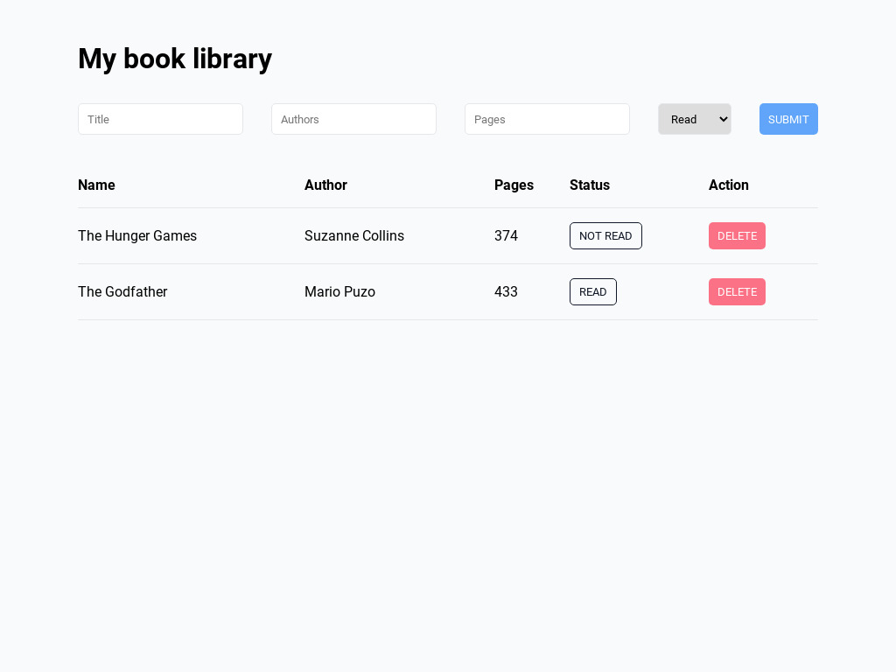

# Book library
### About the project
This project is for learning front-end development. The book library allows users to input book titles, authors, page numbers and set the status as read or not read, books can also be deleted from the list. The main objective of this project was to gain knowledge in JavaScript Objects, Object Constructors, and LocalStorage.

Desktop screenshot

  <ol>
    
  </ol>

### [Live preview](https://liudasbo.github.io/book-library/)

---
### Built With
* HTML
* CSS
* JavaScript